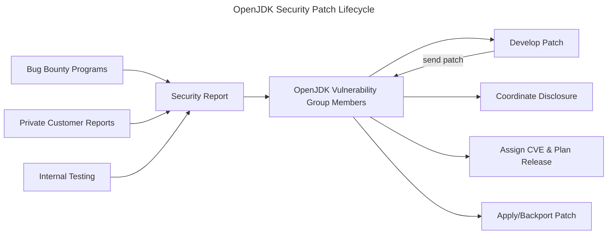
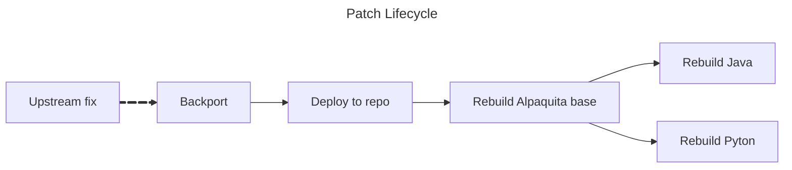

---
# You can also start simply with 'default'
theme: default
# random image from a curated Unsplash collection by Anthony
# like them? see https://unsplash.com/collections/94734566/slidev
background: /background.jpg
# some information about your slides (markdown enabled)
title: Zero-Days, One Team
info: |
  Open-source is inheretantly safer than closed source.

  In this taslk I explain how it works for BellSoft and how we are secure first.
# https://sli.dev/features/drawing
drawings:
  persist: false
# slide transition: https://sli.dev/guide/animations.html#slide-transitions
transition: none
# enable MDC Syntax: https://sli.dev/features/mdc
mdc: true
shiki: { theme: "nord" }
# open graph
# seoMeta:
#  ogImage: https://cover.sli.dev
---

# Zero-Days, One Team

## How BellSoft Fixes What’s Broken

Pasha Finkelshteyn, BellSoft

---

# `whoami`

- Developer Advocate at BellSoft
- &gt; 10 years in JVM development
- Obviously use Spring
- Average security enjoyer

---
layout: cover
---

# How do we do it in BellSoft?

---

# BellSoft’s Security Philosophy

- Proactive, not reactive
- CVE ≠ failure, but unresolved CVE is
- Backport first
- Alpaquita + Liberica: full-stack control

<v-click>

Why? Because shipping secure software is a process, not an event.

</v-click>

---
layout: two-cols
---

# Liberica JDK

- We support 8, 9, 11, 17, 21, 25
- Multiple CPU architectures
- Usual JDK & NIK
- Swing & JavaFX

Also CNCF, Linux Foundation, JCP EC, etc...

::right::

<v-click>

# Alpaquita Linux

- Based off Alpine
- Performance optimizations for musl
- Version with glibc
- Multiple languages

</v-click>

---
layout: two-cols-header
---

# Why Open Source Matters?

> “Given enough eyeballs, all bugs are shallow.” — Linus Torvalds

::left::

## Community

- Feature requests
- Bug reports
- Freedom 🏴󠁧󠁢󠁳󠁣󠁴󠁿
- Patches (might be tricky)

::right::

## Technologies

- Security audit
- Possible to modify/harden to your needs (jlink, jre, etc)
- Controllable updates

---

# Why Open Source Enables Faster Zero-Day Mitigation

- Transparent discovery and patching
- BellSoft merges patches from upstream
- Shared security testing (OpenJDK Vulnerability Group)

---

# OpenJDK Security Vulnerability Flow

---

# OpenJDK: CVE-2024-21138

## Partial DoS

- _Relatively_ low-risk (3.7/10)
- Hard to execute (details are not disclosed, but multiple protocols are vulnerable)
- All Java versions since at least 8 are vulnerable

<v-click>

Timeline:

- (date unknown): Discovery
- July 16, 2024: Published and disclosed

</v-click>

---
layout: statement
---

# But sometimes it's harder

---

# GStreamer: CVE-2024-47606

- Crafted media file can overwrite function pointers via malicious payload.
- Leads to **arbitrary code execution** on vulnerable systems via gst_memory_unmap.
- **CVSS 3.1: 9.8/10 — Critical**

<v-click>

JavaFX native support for multimedia

</v-click>

<v-click>

- _2024-09-26_: Issue reported at https://gitlab.freedesktop.org/gstreamer/gstreamer/-/issues/3851
- _2024-09-26_: Issue acknowledged
- _2024-12-03_: Fixed and disclosed

</v-click>

<v-click>

But

</v-click>

---

# In OpenJDK it took some time

## Fixed in the April release

Bellsoft backported/applied it to:

<v-click>

- 8u452+11
- 11.0.27+9
- 17.0.15+10
- 21.0.7+9
- 24.0.1+11

</v-click>

---

# musl: CVE‑2025‑26519

> An attacker could exploit a vulnerability in musl libc (versions up to 1.2.5) by providing a specially crafted EUC-KR input during `iconv` conversion to UTF‑8, causing an out‑of‑bounds write. This could lead to code corruption or, in some cases, remote code execution on systems using musl.

https://docs.bell-sw.com/security/cves/CVE-2025-26519/

The patch was backported and available in the repos **the same day**

---

# What If It Was Closed Source?

 <v-click>

- Vulnerability silently present
- Fix delayed or hidden
- Vendor may require extended contract for fix
- No community pressure = no urgency

</v-click>
<v-click>

Open Source = Shared Risk, Shared Response

</v-click>

---

# TL;DR — Why Open Source Security Works

- Vulnerabilities are inevitable, but secrecy helps no one
- OSS allows:
  - Faster detection (many eyes 👀)
  - Faster fixes (community & vendor synergy 🤝)
  - Better hardening (jlink, custom builds 🛡)

<v-click>

Open source isn't just code — it's a contract with the community

</v-click>

---

# 🔐 Zero-Days, One Team

## Thank you!

Let’s make software that’s secure
because it’s open, not in spite of it.

@asm0dey | bell-sw.com
